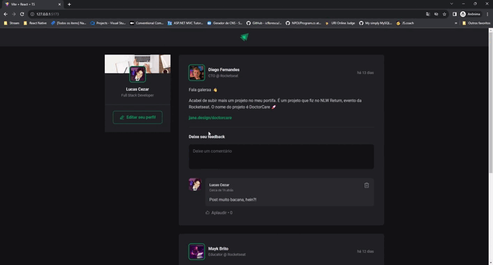

# Ignite Blog

  Este é o primeiro projeto feito através do treinamento adquirido da [Rocketseat](https://www.rocketseat.com.br/)  utilizando os principais fundamentos do React com TypeScript, como: 
  
 - Estado
 - Componentes
 -  Propriedade



  

> O projeto visa utilizar os fundamentos do React/TypeScript, simulando algumas postagem de blogs, no qual você pode comentar, curtir(no caso do projeto aplaudir) quantas vezes quiser e até excluir comentários.

  
  

## 💻 Pré-requisitos

  

Antes de começar, verifique se você atendeu aos seguintes requisitos:

* [`Node`](https://nodejs.org/en)(LTS) instalado. 
* [`Yarn`](https://yarnpkg.com/) instalado caso não utilize o npm.
  

## 🚀 Instalando as dependências
  
Para rodar o projeto Ignite Blog, entre na pasta do projeto com o terminal e siga a etapa abaixo:

  ```
Yarn: yarn
Npm: npm install
```

  

## ☕ Usando Ignite Blog


  

Para rodar o projeto, siga estas etapas, no terminal digite:

  

```
yarn dev (caso utilize Yarn)
npm run dev (caso utilize npm)
```

  


  
